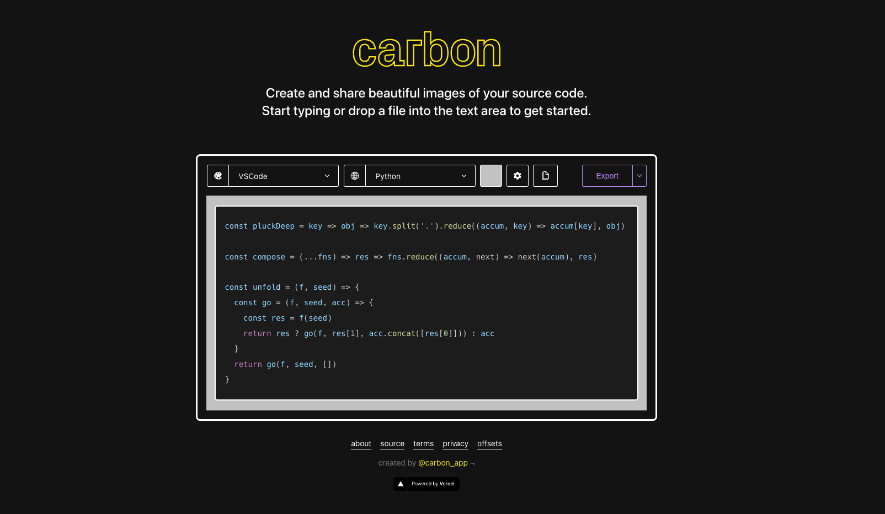
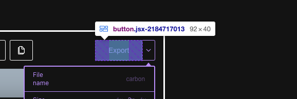
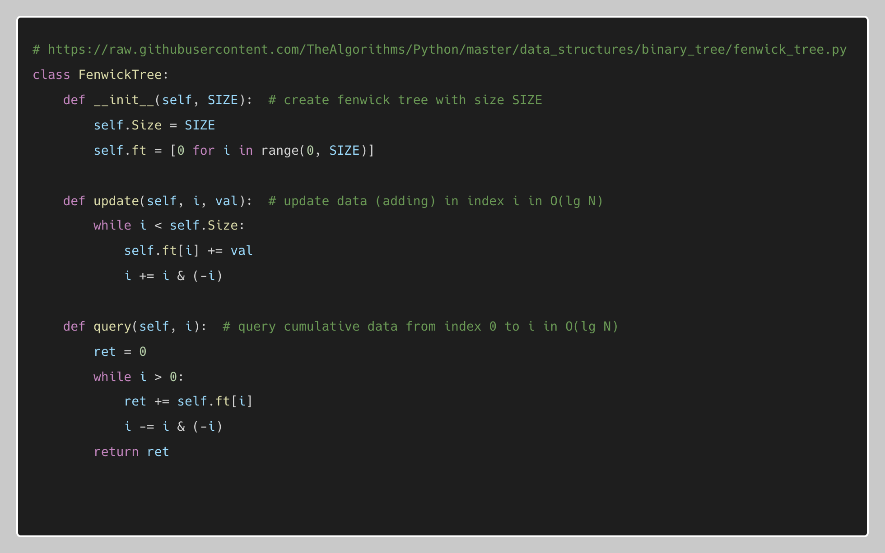
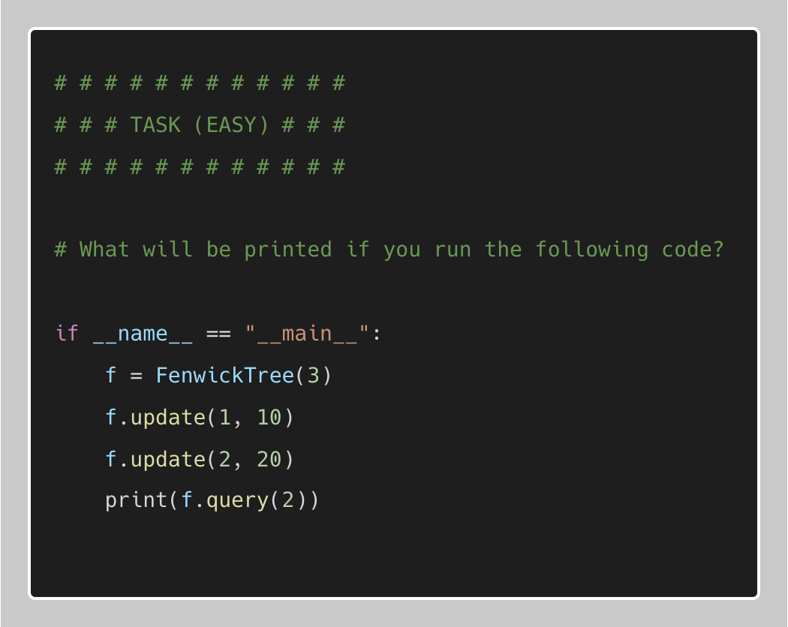

Create beautiful PNG images of your code using [Carbon](https://carbon.now.sh/) (free online service that generates code snippet images) and [Selenium](https://www.selenium.dev/) (Python package that automates the browser).

I want to create lots of nice looking images of my code. Usually you would take a screenshot of your code - however I have a lot of code snippets that I want to convert into images. They should also look consistent (regarding padding space, width etc.). 

## Carbon generates images of your code



[Carbon](https://carbon.now.sh/) is a free open source web service that let's you generate beautiful images of your code. You can use it directly in your browser if you want to create a (or multiple) code snippets.

Because I have 40+ code snippets, I want to automate the process of pasting the code and exporting it. To automate browser processes, we can use [Selenium](https://www.selenium.dev/). 

## Install required Python packages

### Install Selenium
Install [Selenium](https://www.selenium.dev/):

```python
pip install selenium
```

### Download Web Driver
Download [web driver](https://chromedriver.chromium.org/). E.g. use the ChromeDriver from Chromium. Make sure the driver version matches your Chrome Browser version.
Add the downloaded exectuable file to your `$PATH` variable.


## Automate the image generation with Python, Selenium and Carbon

Using Python, Selenium (to automate the browser) and Carbon (being the website that generates the images), we can automate the process of generating new images based on code-snippet files that exist on our local machine. First, import the required Selenium modules and setup the carbon URL:

```python
from selenium import webdriver
from selenium.webdriver.common.by import By
from selenium.webdriver.chrome.options import Options

CARBON = 'https://carbon.now.sh/?' \
         'bg=rgba%28201%2C201%2C201%2C1%29' \
         '&t=vscode' \
         '&wt=bw' \
         '&l=auto' \
         '&width=879' \
         '&ds=false' \
         '&dsyoff=20px' \
         '&dsblur=68px' \
         '&wc=false' \
         '&wa=true' \
         '&pv=18px' \
         '&ph=18px' \
         '&ln=false' \
         '&fl=1' \
         '&fm=Hack' \
         '&fs=14px' \
         '&lh=199%25' \
         '&si=false' \
         '&es=2x' \
         '&wm=false' \
         '&code={code}'
```

You can adjust the parameters specified in the URL. E.g. the theme name `&t=vscode` or the programming language `&l=auto` used for syntax highlighting. 

If we would manually export code snippets, we would click on the _Export_ button. Selenium can automate the button-clicking process for us. However, we need to tell Selenium what button to click. Let's inspect the button by using Chrome's Inspector.



```python
EXPORT_BUTTON_CLASS = "jsx-2184717013"
```

Let's define a variable that contains the class name of the _Export_ button. Alternatively we could use the button text to identify the button, however the unique class name is more safe, than just searching for the text "Export".

Let's define a function that will start a web browser, open the Carbon website, click on export and rename the downloaded file:

```python
def generate_code_snippet_image(code: str, filename: str):
    # make code url safe
    safe_code = urllib.parse.quote_plus(code)

    # set carbon url containing code
    url = CARBON.format(code=safe_code)

    # selenium webdriver
    driver = webdriver.Chrome() # setup chrome
    driver.get(url) # load carbon webpage
    driver.find_element(By.CLASS_NAME, EXPORT_BUTTON_CLASS).click() # click on export image button

    # wait while downloading and rename file
    sleep(3)
    downloads_folder = f"{Path.home()}/Downloads"
    os.rename(os.path.join(downloads_folder, 'carbon.png'), os.path.join(downloads_folder,f"{filename}.png"))
    print(f"generated {filename}.png")
```

The following line is responsible for clicking on the button, that is being identified `By.CLASS_NAME`: 

```python
driver.find_element(By.CLASS_NAME, EXPORT_BUTTON_CLASS).click() # click on export image button
```

Now we can iterate over all our files and let our function generate the images, rename them and save them to our Downloads folder:

```python
import os
from pathlib import Path
parent_dir = "./YOUR_DIR_CONTAINING_CODE_SNIPPETS/"

for subdir, dirs, files in os.walk(parent_dir):
    for file in files:
        # ignore hidden & readme files
        if file.startswith(".") or file == "README.md":
            continue

        # read code snippet and generate image
        f = open(os.path.join(subdir, file), "r")
        code = f.read()

        try:
            delimiter_index = code.find("# # # # # # # # # # # #")
            generate_code_snippet_image(code[:delimiter_index], f"{file[:-3]}-code")
            generate_code_snippet_image(code[delimiter_index:], f"{file[:-3]}-task")
        except Exception as e:
            print(f"Error occurred for {file}: {e}")

```

If you wonder about the `try` statement: My files contain both code and a coding task (see example below). I want to generate seperate images for the code and the task. Therefore I'm trying to find my delimiter `"# # # # # # # # # # # #"` and cut off the rest for generating the actual code snippet. Secondly I'm just providing the rest to generate another image that contains the task description. 


## Example Code Snippet and automatically generated images
### Local Example Code-Snippet File:
```python
# https://raw.githubusercontent.com/TheAlgorithms/Python/master/data_structures/binary_tree/fenwick_tree.py
class FenwickTree:
    def __init__(self, SIZE):  # create fenwick tree with size SIZE
        self.Size = SIZE
        self.ft = [0 for i in range(0, SIZE)]

    def update(self, i, val):  # update data (adding) in index i in O(lg N)
        while i < self.Size:
            self.ft[i] += val
            i += i & (-i)

    def query(self, i):  # query cumulative data from index 0 to i in O(lg N)
        ret = 0
        while i > 0:
            ret += self.ft[i]
            i -= i & (-i)
        return ret

# # # # # # # # # # # #
# # # TASK (EASY) # # #
# # # # # # # # # # # #

# What will be printed if you run the following code?

if __name__ == "__main__":
    f = FenwickTree(3)
    f.update(1, 10)
    f.update(2, 20)
    print(f.query(2))
```

### Images Generated by the Selenium + Carbon script:

#### Code Image:



#### Task Image:




You can find the full script used to generate the images in this [Github Gist](https://gist.github.com/Taremeh/f7ea96c6610d83aad7d5d2e5db955e53).