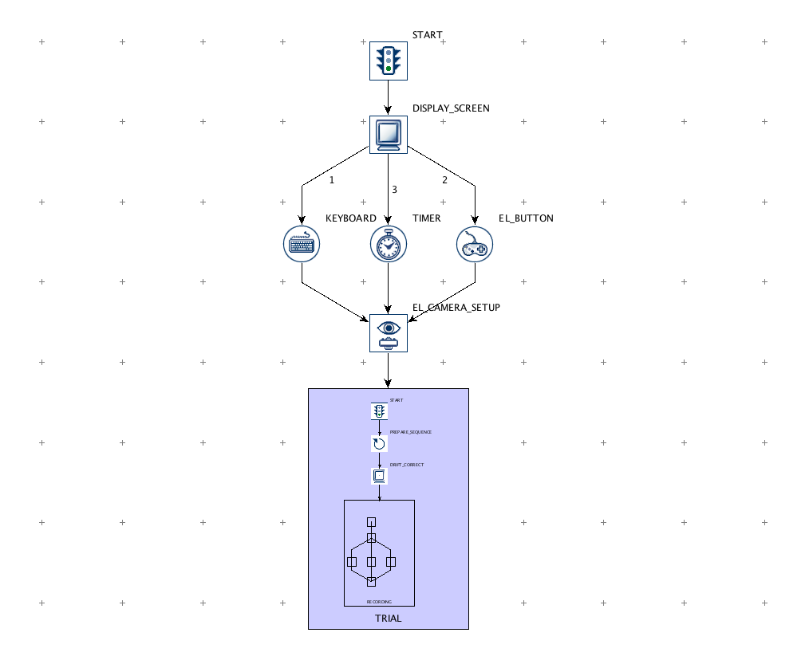
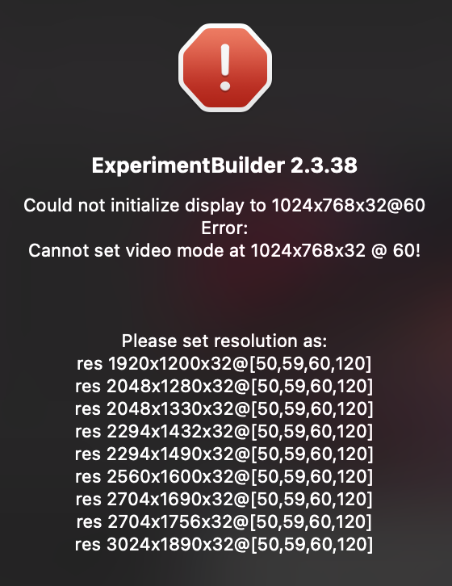

_preface: I am using the EyeLink Portable Duo from SR Research for my bachelor thesis that involves eye-tracking. This tutorial should help you getting started with using the relevant software (i.e. ExperimentBuilder), such that you can setup your first experiment._

Use this getting started guide if you don't want to read through 400+ pages of the offical ExperimentBuilder User Manual.

---

## ExperimentBuilder Installation & Sample Project
1. Download **ExperimentBuilder** from [sr-support.com](https://www.sr-support.com/thread-1.html)
    - Note: You'll need a forum account to access the download page. Just [register](https://www.sr-support.com/member.php?action=register) an account, wait for activation and then proceed to the download page.
2. Install the **ExperimentBuilder** and the *HASP driver* if your sr-research USB license key dongle is not detected by your computer. 
    - How do you know if the USB license key is working? The physical USB license stick will turn on a weak red LED if plugged into your computer and if working correctly.
3. Start the **ExperimentBuilder** application
4. Let's start with a simple example. Go to the menu and select `File > Examples > Simple`. The following graph should appear.  This is an overview over your experiment setup. Click on the nodes to inspect them for more details that will appear on the left-hand-side under _Properties_. There you can adjust the properties (e.g. adjust the duration of a timer). Furthermore you are provided with explainatory notes for each node.
    - You can double-click into the `TRIAL` section (purple container) to examine the substructure
    - Doube-Click into the purple `RECORDING` subsection to open further expand.
    - To orient yourself while browsing through the subsections, you can look at the _Structure_ overview on the left-hand-side or at the navigator at the bottom.
5. Go to the menu an click on `Experiment > Test Run` to run the experiment.
    - If you encounter an error as seen in the screenshot below, go to the menu and click `ExperimentBuilder > Preferences... > Experiment > Devices > Display>` and set the width/hight/bits per pixel property according to the error message. 
    
6. Press the space bar or any key to navigate through the experiment.

Well done! Now let's explore what types of nodes ExperimentBuilder offers:

## Node Types
- **Action Nodes** (Do/Play/Show something)  (displayed in square nodes)
- **Trigger Nodes** (Wait for input/timer/eye fixation)  (displayed in circle nodes)

## Further Resources
- Official ExperimentBuilder Tutorial Series:
    - https://www.youtube.com/watch?v=qCMgHiGbWN4&list=PLOdF-B36TwspI-XgKuRC2xFfa768Lsngv
- ExperimentBuilder Youtube Tutorial (2 parts, unfortunately quite incomplete)
    - Part 1: https://www.youtube.com/watch?v=RTRpIpUAuO8
    - Part 2: https://www.youtube.com/watch?v=DqTRR-xNHiE