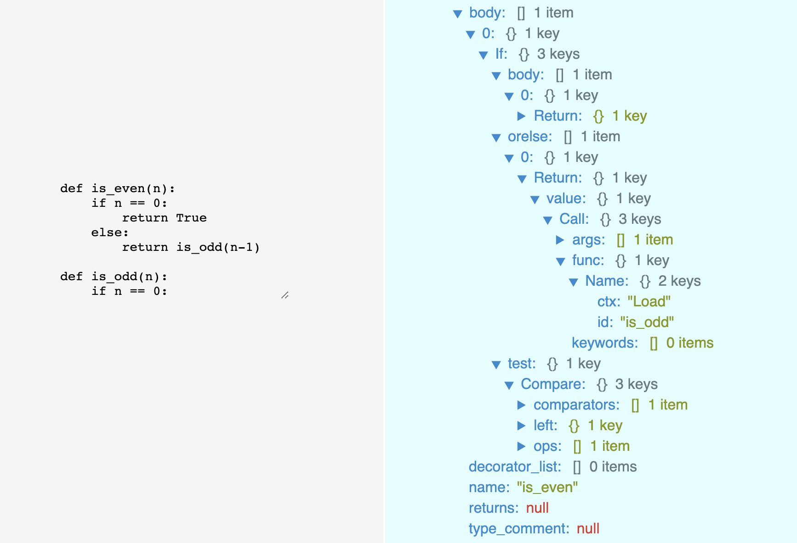

Why is it so hard for a program to identify recursive functions? Humans, including non-programmers (!), can easily spot a recursive function. Look at the following example:

```python
def count_to_zero(num: int):
    if num < 0:
        return
    print("f{num}")
    return count_to_zero(num-1)
```

Is this a recursive function?

Yes! Because in the return statement of the function `count_to_zero`, the function calls itself. Therefore, it is a recursive function. 

So why is it so hard to for a script to determine whether a module contains a recursive function as seen in the example? There is actually an easy way to find out whether a function is recursive, if you're only dealing with well functioning Python modules that do not produce errors. Here is the code to determine if a function is recursive:

## Check whether function is recursive with 1 line of code

```python
def is_function_recursive(function: Callable):
    return function.__name__ in function.__code__.co_names
```

This boolean check evaluates to `True` if the function name is called in its function body.

`__code__.co_names` is a _[tuple of names other than arguments and function locals](https://docs.python.org/3/library/inspect.html#types-and-members)_, which would include the function name in the tuple, if the function is recursive.

So why am I complaining if you only require one line of code to determine whether a function is recursive? Well, this is only the case if your code does not contain any errors. Then you can exploit these built-in functions and attributes Python provides you. However, assume you've only got a code snippet which import many unknown or missing modules, or has unfixable bugs, or has undefined variables. Furthermore, assume you want to analyze a big corpus (10'000 files or more) of such non-functioning code snippets.

For my bachelor thesis I am confronted with 40'000 Python files, that have been scraped from Github. They do contain errors, unknown imports, input statements etc.

For a big corpus you would want to dynamically import the code snippets and use the `is_function_recursive` function to check whether a code snippet contains recursive calls. Unfortunately, your errornous imports would fail because Python executes all your imported code and you can't prevent Python from doing so. Encapsulating all the code into a `if __name__ == '__main__'` clause would prevent the execution of the imported code, however, you would also lose the ability to import the classes and functions contained in the `if` body.

## Inspect Python code without executing it

In order to avoid executing the code snippets on import, you would need to treat the code as text: No imports, no built-in functions, no attributes like `function.__code___.co_names`, just plain text.

The most elegant and accurate solution would be analyzing the code by parsing the plain text into an **Abstract Syntax Tree** (AST). That Syntax Tree would represent the code in a tree containing statements, variables and constructs as nodes with connections between them. This way you can also easily count how often a specific statement occurs. E.g. how many for and while loops a Python module contains:

```python
def count_loops(code: str) -> int:
    try:
        # adapted from https://stackoverflow.com/a/54093401
        loop_counter = 0
        loop_statements = ast.For, ast.While, ast.AsyncFor
        nodes = ast.walk(ast.parse(code))

        for node in nodes:
            if isinstance(node, loop_statements):
                loop_counter += 1
        return loop_counter
    except:
        return 0
```

Doing a similar AST walk thorugh the nodes to find recursions is a bit harder. You can parse the code into an AST Tree and check whether the return values of the function contains another function call to itself. Here is the function to check whether a code contains recursive (and even mutually recursive) functions:

```python
def count_recursions(code: str) -> int:
    self_recursion_functions = set()
    mutual_recursion_candidates = {}
    mutual_recursion_functions = set()
    nodes = ast.parse(code)
    function_nodes = []

    # get all function nodes
    for node in nodes.body:
        if isinstance(node, ast.FunctionDef):
            function_nodes.append(node)
            mutual_recursion_candidates[node.name] = set() # init dict

    # check for self recursion functions and mutual recursion candidates
    for node in function_nodes:
        for node_of_function in ast.walk(node):
            if isinstance(node_of_function, ast.Return) and isinstance(node_of_function.value, ast.Call):
                # check if return statement contains call to its own function
                if node_of_function.value.func.id == node.name:
                    # return statement contains call to its own function => function is recursive
                    self_recursion_functions.add(node.name)
                else:
                    # add function call of return statment to mutual_recursion_candidates
                    mutual_recursion_candidates[node_of_function.value.func.id].add(node.name)

    # check for mutual recursion functions
    for node in function_nodes:
        for node_of_function in ast.walk(node):
            if isinstance(node_of_function, ast.Return) and isinstance(node_of_function.value, ast.Call):
                # check if return statement contains call to its own function
                    if node.name in mutual_recursion_candidates[node_of_function.value.func.id]:
                        # functions are mutually recursive
                        mutual_recursion_functions.add(node_of_function.value.func.id)
                        mutual_recursion_functions.add(node.name)

    return len(self_recursion_functions.union(mutual_recursion_functions))
```

This function not only checks but also counts the recursive functions - without executing it. Therefore it is fine that the code contains unknown imports, input promots etc. since we're not actually running it but just creating a Abstract Syntax Tree by parsing it.

Here is an example of an AST Tree (left: code, right: excerpt of the AST):



The excerpt shows part of the `body` of the function definition (`FuncDef`) `is_even` (as seen on the third last line `name: "is_even"`). Going through the nodes, you should be able to connect the code statements on the left to the AST nodes on the right. I.e. the function body opens up with an `if` statement and an `orelse` statement. The `orelse` statement contains a `Return` node with a `Call` node, containing the function (`func`) with id `is_odd` which can also be found in the code. The `count_recursions` I have provided above goes through the nodes, checks for callable return values and checks their function names against itself (self recursion) or against other functions (mutual recursion).

I have found the [python-ast-explorer](https://python-ast-explorer.com/) to be helpful in generating such AST Trees as seen in the screenshot.

A next step could be improving the `count_recursions` function to not only capture self recursions and mutual recursions (up to two functions), but all possible recursions (e.g. mutual recursions of n-th degree).

Furthermore there are many variations of how a recursive function can look like. The code from above only captures recursive functions that call themselves in their own return statement. However, the recursive call can also be located inside the function body before the return statement - capturing all the possible variants of recursions, especially mutual recursion means inspecting and detecting all the different forms of recursive functions. 

Here you can find a function I've written to detect recursive functions with
- recursive calls in the return statement
- recursive calls in the function body
- mutual recursion up to 2nd degree (e.g. is_even calling is_odd calling is_even and so on)
- Download-Link: [Github Gist](https://gist.github.com/Taremeh/f760d5a24e13cc4b4bf663f43c0203be)